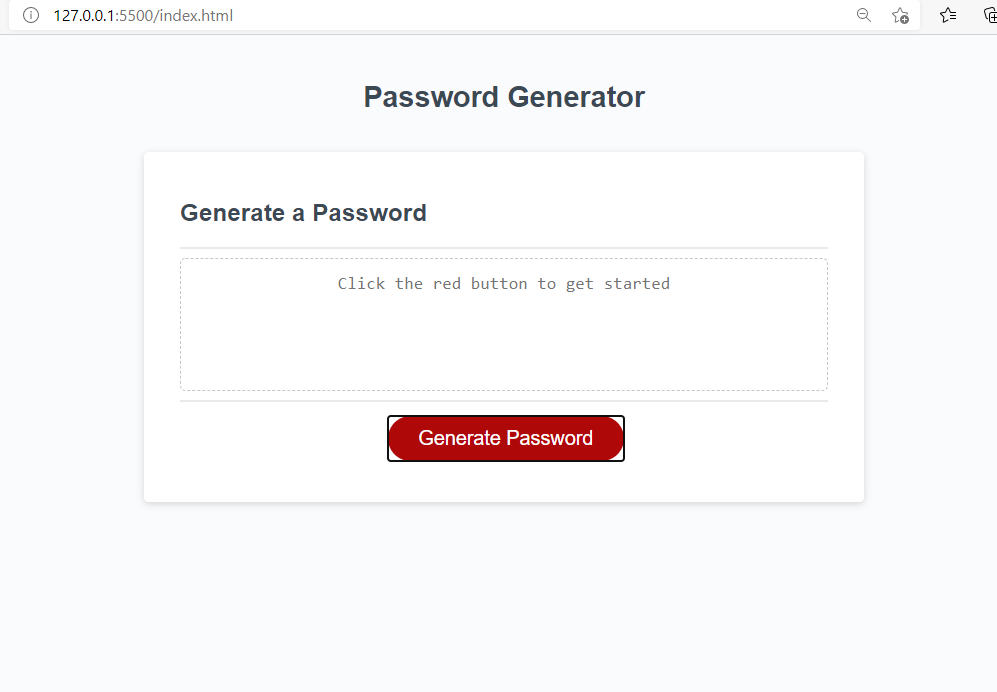
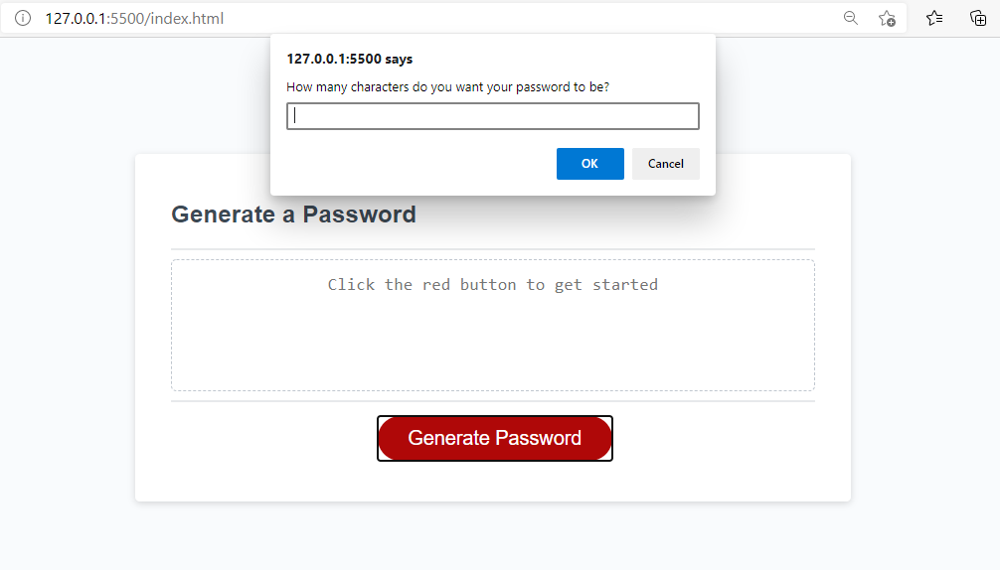

# password-generator

## Description
The project was made in order to build a password generator, one that allows the user to choose the characters and lenght of the password. By using this password generator the user prevent a security risk by getting a strong password. 

## Techonologies
 * Javascript
 * HTML
 * CSS

## Project status
This project will be updated with some improvement regarding the password generation. 

## Installation
 * Create a repo on GitHub
 * Clone the repo on the computer
 * Create an HTML, CSS and Javascript file
 * Write the HTML and CSS code previously provided
 * Write the Javascript code
 * Use google DevTools in order to inspect if the code is running correctly
 * Pull and commit changes on Github
 * Publish the website on Github pages

 ## Contact information
 email: sofiacarf@gmail.com

## Finished Project

## Link to the website
https://sofiacrf.github.io/Password-Generator/

